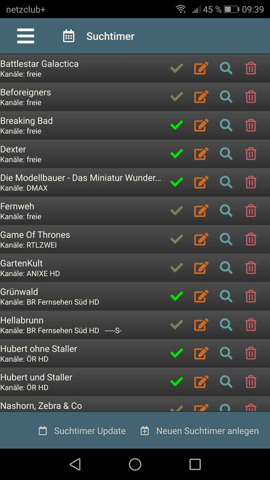
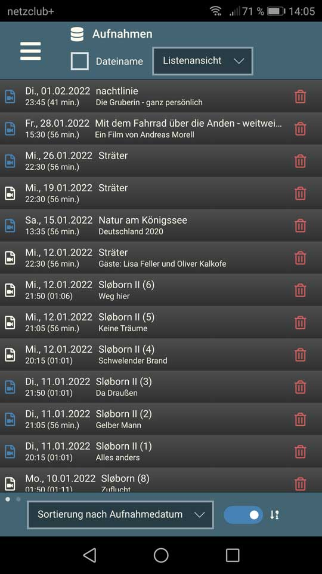

## Beschreibung
Eine App für Android-OS zum Bedienen eines VDR. Sie ermöglicht unter anderem
* [Programm](#programm): Eine Programmübersicht (EPG) anzeigen (Was läuft jetzt, als Nächstes etc.) Daraus läßt sich ein Timer anlegen oder eine Suche ausführen. Über das Suchergebnis kann ein Suchtimer angelegt werden.
* [Timer](#timer) Eine Timerübersicht mit bearbeiten und löschen [test](#test)
* [Suchtimer](#suchtimer) Eine Suchtimerübersicht mit bearbeiten und löschen
* [Aufnahmen](#aufnahmen) Eine Übersicht mit zwei Ansichten (Baumstruktur, Liste) mit Sortier- und Filterfunktionen 

## Voraussetzung

Auf dem VDR sind die Plugins RestfulApi und EPGSearch notwendig. Weitere Maßnahmen sind nicht erforderlich. 

Anstatt der Kanalnummer können auch Kanalicons ausgegeben werden. Dazu muß dem Plugin der Pfad zu den Icons mitgegeben werden. Nähere Informationen stehen in der Api.html bei der [RestfulApi-Dokumentation](https://github.com/yavdr/vdr-plugin-restfulapi)

Empfehlenswerte Icons sind z.B. die [Picons2VDR](https://github.com/MegaV0lt/Picons2VDR) 

## Programm

Über die Programmübersicht (EPG) lassen sich die üblichen Funktionen eines VDR abrufen: **Was läuft jetzt?**, **Was läuft als nächstes?**". Über ***Uhrzeit*** kann auch ein beliebiger Zeitpunkt gewählt werden, ab dem das EPG angezeigt werden soll. Wird die Uhrzeit abgespeichert erscheint eine zusätzliche Drowdownliste mit allen individuell angelegten Uhrzeiten (***Um...***). Die Liste läßt sich in den Einstellungen bearbeiten.

Ein Tipper auf die Kanalnummer (oder Kanalicon) zeigt das Programm des ausgewählten Kanals an. Es erscheint dann im Kopfbereich eine Liste, über die ein anderer Kanal ausgewählt werden kann.

Tippt man auf die Beschreibung erscheint ein weiteres Fenster mit Detailinformationen.  

Hinweis: Die Fußzeile besitzt zwei Ansichten. Mit einem Wischer erscheint auf der zweiten Seite ein Textfilter, der sich nur auf das angezeigte EPG auswirkt.  

| Icon | Beschreibung |
| --- | ---|
| | Über das Timersymbol kann ein Timer angelegt oder bearbeitet werden. Bei einem neuen Timer werden der Kanal und die Uhrzeit übernommen. Die Voreinstellungen wie Vorlauf, Nachlauf, Priorität und Lebensdauer werden berücksichtigt. |
|  | Inaktiver Timer |
|  | Aktiver Timer |
|  | Sucht nach Wiederholungen im EPG. Dabei wird der Titel übernommen und der Kanal voreingestellt. Im Dialog läßt sich die Suche noch verfeinern mit allen Parametern, die der VDR bzw. das Plugin EPGSearch zur Verfügung stellt. Jede Suche wird abgespeichert und läßt sich über den Button ***Suche*** wieder aufrufen. Ist man mit dem Ergebnis zufrieden, kann ein (inaktiver) Suchtimer angelegt werden. |
|  | Schaltet auf den Kanal um. |

  
## Timer

Die Timerliste unterscheidet sich in einem Punkt von den anderen Programmbereichen. Sie wird lediglich beim Programmstart einmal abgerufen und enthält auch keine Ereignisse zu den Timern. So wie es der VDR in seinem OSD auch anzeigt. Es kann also durchaus vorkommen, daß ein bereits veralteter Timer noch vorhanden ist.

Über den Button ***Aktualisieren*** im Fußbereich holt man sich die aktuelle Timerliste und ebenfalls die dazugehörigen Programmbeschreibungen.

Ein Fingertip auf die Kanalnummer (oder Kanalicon) zeigt das EPG des ausgewählten Kanals an.

Tippt man auf die Beschreibung erscheint ein weiteres Fenster mit Detailinformationen.

**Hinweis:** Die Timericons schalten den jeweiligen Status sofort um. So wird ein aktiver Timer deaktiviert und umgekehrt.

| Icon | Beschreibung |
| --- | --- |
|  | Ein manuell angelegter inaktiver Timer. Entweder ein einmaliger oder wiederholender Timer, wie sie der VDR standardmäßig zur Verfügung stellt. |
|  | Der Timer ist aktiv. |
|  | Ein von einer Suche automatisch angelegter inaktiver Timer. Solche Suchtimer werden über das Plugin EPGSearch zur Verfügung gestellt und werden über den Programmteil Suchtimer verwaltet. | 
|  | Ein aktiver Timer von einem Suchtimer erzeugt. |
|  | Timer bearbeiten |
|  | Timer löschen |

## Suchtimer

Suchtimer werden vom Plugin EPGSearch bereitgestellt. Sie durchsuchen das EPG und setzen automatisch einen Timer, wenn die Suchkriterien zutreffen. Eine genaue Beschreibung findet man bei der Dokumentation. Suchtimer werden in der Timerliste mit einem anderen Icon gekennzeichnet.

| Icon | Beschreibung |
| --- | --- |
|  | Der Suchtimer ist nicht aktiv, d.h. in den Suchkriterien ist das Feld *Als Suchtimer verwenden* nicht gesetzt.  |
|  | Ein aktiver Suchtimer. Das Feld *Als Suchtimer verwenden* ist angekreuzt. Es sagt aber nichts darüber aus, welche Aktion ausgeführt wird *(Aufnehmen, per OSD ankündigen, ...)*. |
|  | Suchtimer bearbeiten |
|  | Sucht im EPG mit den eingestellten Suchparametern und zeigt alle Treffer an. Das Timersymbol gibt Auskunft über den Status (aktiv/inaktiv). | 
|  | Suchtimer löschen |

## Aufnahmen

Bei den Aufnahmen gibt es zwei Ansichten mit unterschiedlichen Sortier- und Filterfunktionen. In den Einstellungen kann voreingestellt werden, welche Ansicht standardmäßig aktiv sein soll.

### Baumansicht
Die Baumansicht zeigt die Aufnahmen so wie der VDR in einer Baumstruktur mit Ordnern und Videodateien. Die Sortierung wirkt sich nur auf die Videodateien aus. Sortiert werden kann nach Aufnahmedatum oder Titel.  
**Hinweis:** Um eine Ebene höher zu gelangen muß das Icon (Pfeil nach oben) im Kopfbereich genutzt werden.

### Listenansicht
Die Listenansicht zeigt alle Videodateien in einer einzigen Liste an. Sie kann nach Aufnahmedatum oder alphabetisch nach dem Titel sortiert werden, auch in umgekehrter Reihenfolge. Daneben existiert im Fußbereich noch eine zweite Seite mit einem Textfilter, der sowohl Titel als auch Untertitel durchsucht.

| Icon/Farbe | Beschreibung |
| --- | --- |
|  | Blau: Die Aufnahme wurde vom VDR als neu eingestuft. Bereits abgespielte Aufnahmen sind weiß. |
|  | Die Schere zeigt eine geschnittene Aufnahme an. Bei den Farben gilt dasselbe wie oben. |
