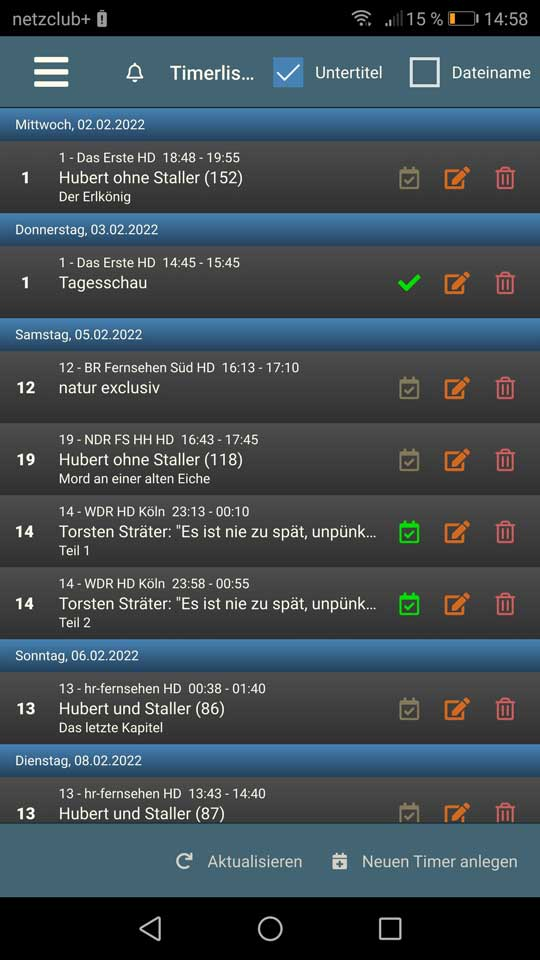

## Inhaltsangabe

* Übersicht

## Beschreibung
Eine App für Android-OS zum Bedienen eines VDR. Sie ermöglicht unter anderem
* [Programm](#programm): Eine Programmübersicht (EPG) anzeigen (Was läuft jetzt, als Nächstes etc.) Daraus läßt sich ein Timer anlegen oder eine Suche ausführen. Über das Suchergebnis kann ein Suchtimer angelegt werden.
* [Timer](#timer) Eine Timerübersicht mit bearbeiten und löschen [test](#test)
* [Suchtimer](#suchtimer) Eine Suchtimerübersicht mit bearbeiten und löschen
* [Aufnahmen](#aufnahmen) Eine Übersicht mit zwei Ansichten (Baumstruktur, Liste) mit Sortier- und Filterfunktionen 

## Voraussetzung

Auf dem VDR sind die Plugins RestfulApi und EPGSearch notwendig. Weitere Maßnahmen sind nicht erforderlich. 

Anstatt der Kanalnummer können auch Kanalicons ausgegeben werden. 

## Programm

Über die Programmübersicht (EPG) lassen sich die üblichen Funktionen eines VDR abrufen: *Was läuft jetzt?*, **Was läuft als nächstes?**". Über Uhrzeit kann auch ein beliebiger Zeitpunkt gewählt werden, ab dem das EPG angezeigt werden soll. Wird die Uhrzeit abgespeichert, erscheint eine zusätzliche Drowdownliste mit allen individuell angelegten Uhrzeiten (<i>Um...</i>). Die Liste läßt sich in den Einstellungen bearbeiten.  
Ein Fingertip auf die Kanalnummer (oder Kanalicon) zeigt das Programm des ausgewählten Kanals an. Es erscheint dann im Kopfbereich eine Liste über die ein anderer Kanal ausgewählt werden kann.  
Tippt man auf die Beschreibung erscheint ein weiteres Fenster mit Detailinformationen.  
Hinweis: Die Fußzeile besitzt zwei Ansichten. Mit einem Wischer erscheint auf der zweiten Seite ein Textfilter, der sich nur auf das angezeigte EPG auswirkt.  

| Icon | Beschreibung |
| --- | ---|
| | Über das Timersymbol kann ein Timer angelegt oder bearbeitet werden. Bei einem neuen Timer werden der Kanal und die Uhrzeit übernommen. Die Voreinstellungen wie Vorlauf, Nachlauf, Priorität und Lebensdauer werden berücksichtigt. |
|  | Inaktiver Timer |
|  | Aktiver Timer |
|  | Sucht nach Wiederholungen im EPG. Dabei wird der Titel übernommen und der Kanal voreingestellt. Im Dialog läßt sich die Suche noch verfeinern mit allen Parametern, die der VDR bzw. das Plugin EPGSearch zur Verfügung stellt. Jede Suche wird abgespeichert und läßt sich über den Button <i>Suche</i> wieder aufrufen. Ist man mit dem Ergebnis zufrieden, kann ein (inaktiver) Suchtimer angelegt werden. |
|  | Schaltet auf den Kanal um. |

  
## Timer

Die Timerliste unterscheidet sich in einem Punkt von den anderen Programmbereichen. Sie wird lediglich beim Programmstart einmal abgerufen und enthält auch keine Ereignisse zu den Timern. So wie es der VDR in seinem OSD auch anzeigt. Es kann also durchaus vorkommen, daß ein bereits veralteter Timer noch vorhanden ist.  
Über den Button <i>Aktualisieren</i> im Fußbereich holt man sich die aktuelle Timerliste und ebenfalls die dazugehörigen Programmbeschreibungen.  
Ein Fingertip auf die Kanalnummer (oder Kanalicon) zeigt das EPG des ausgewählten Kanals an.  
Tippt man auf die Beschreibung erscheint ein weiteres Fenster mit Detailinformationen.  
**Hinweis:** Die Timericons schalten den jeweiligen Status sofort um. So wird ein aktiver Timer deaktiviert und umgekehrt.

| Icon | Beschreibung |
| --- | --- |
|  | Ein manuell angelegter inaktiver Timer. Entweder ein einmaliger oder wiederholender Timer, wie sie der VDR standarmäßig zur Verfügung stellt. |
|  | Der Timer ist aktiv. |
|  | Ein von einer Suche automatisch angelegter inaktiver Timer. Solche Suchtimer werden über das Plugin EPGSearch zur Verfügung gestellt und werden über den Programmteil Suchtimer verwaltet. | 
|  | Der Suchtimer ist aktiv und das dazugehörige Ereignis wird aufgnommen. |
|  | Timer bearbeiten |
|  | Timer löschen |

## Suchtimer
## Aufnahmen
## test
## Installation
